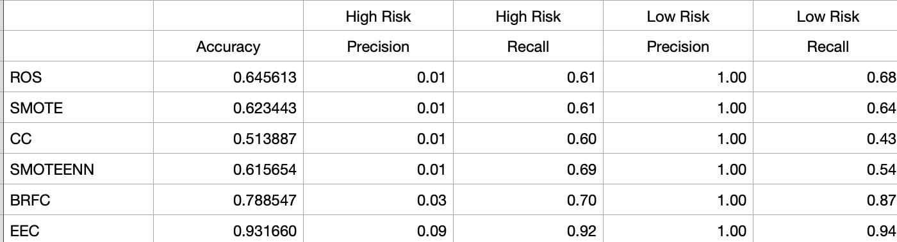
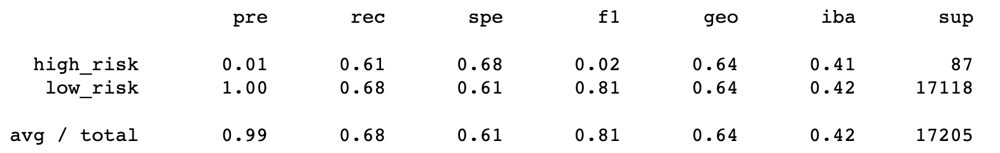
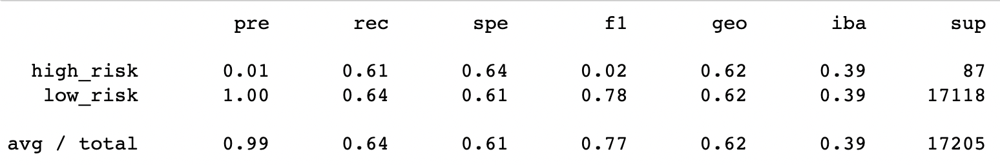
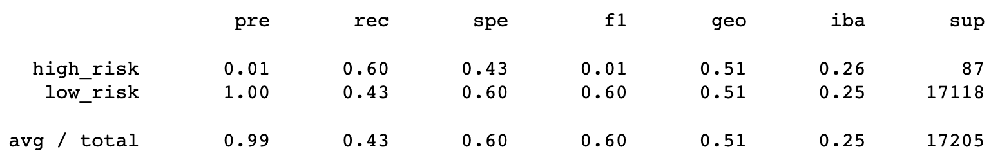
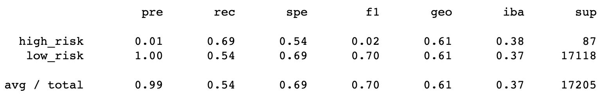
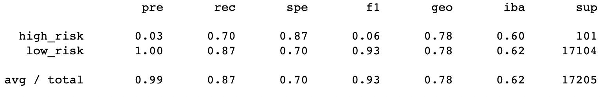
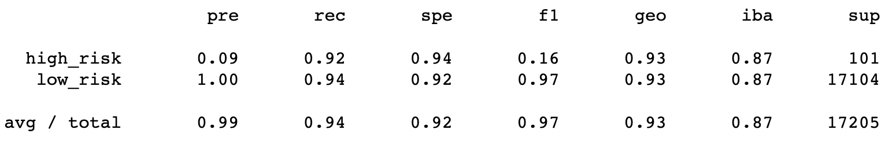

# Credit_Risk_Analysis

## Overview

The purpose of the project is to apply machine learning techniques to classify credit card risk.

Credit risk is an unbalanced classification problem. That is, the proportion of good loans is much higher than the proportion of bad loans. Training a model without adjusting for the imbalance in the data can lead to misleading results. For example, the model can have a high overall accuracy score but is actually very poor at detecting bad loans. Several resampling techniques are explored to address the problem. 

First we oversample the data using the RandomOverSampler and SMOTE algorithms, and undersample the data using the ClusterCentroids algorithm. Then, we use a combinatorial approach of over- and undersampling using the SMOTEENN algorithm. Finally, we compare two new machine learning models that reduce bias, BalancedRandomForestClassifier and EasyEnsembleClassifier from the Imbalanced-Learn library, to predict credit risk. 

A credit card credit dataset from LendingClub, a peer-to-peer lending services company, is used for the analysis. The Imbalanced-Learn and Scikit-Learn libraries are used to resample data and to build and evaluate models. 

## Results

The accuracy, precision and recall scores are summarized for each of the six models:

- Oversampling using Naive Random Oversampling (ROS)

- Oversampling using SMOTE 

- Undersampling using Cluster Centroids (CC)

- Combination (Over and Under) sampling using SMOTEENN

- Balanced Random Forest Classifier (BRF)

- Easy Ensemble AdaBoost Classifier (EEC)

## Summary

Summarize the results of the machine learning models, and include a recommendation on the model to use, if any. If you do not recommend any of the models, justify your reasoning.

Since bad loans are highly undesirable, in addition to overall accuracy, we want the model to be good at detecting high risks. That is, we want to minimize false negatives in High Risk classifications. Therefore, we want to choose a model with a high recall score for High Risk.

- All six models improved the recall score
- The Easy Ensemble AdaBoost Classifier (EEC) and Balanced Random Forest Classifier (BRFC) performed better than the resampled logistic regression models, with EEC scoring highest for every metric
- The two oversampling models (ROS and SMOTE) yielded comparable results for accuracy, precision, and recall scores
- The combination resampling model (SMOTEENN) had similar scores to oversampling except that the Low Risk recall score was lower
- The undersampling model (CC) preformed worst, with the lowest accuracy and recall scores
- All models scored very low in the High Risk precision metric

Based on these metrics, Easy Ensemble AdaBoost Classifier is the best model amongst the six we tested. It should be noted that even though the model scored well on most metrics, the High Risk precision score is extremely low (0.09). This means that we can expect a large number of High Risk predictions to be be false positives. Practically, this may lead to some good risks being declined if the model's results were used to approve/decline loan applications. However, the model can still be a useful tool for flagging potential bad risks to be followed up with further review.

